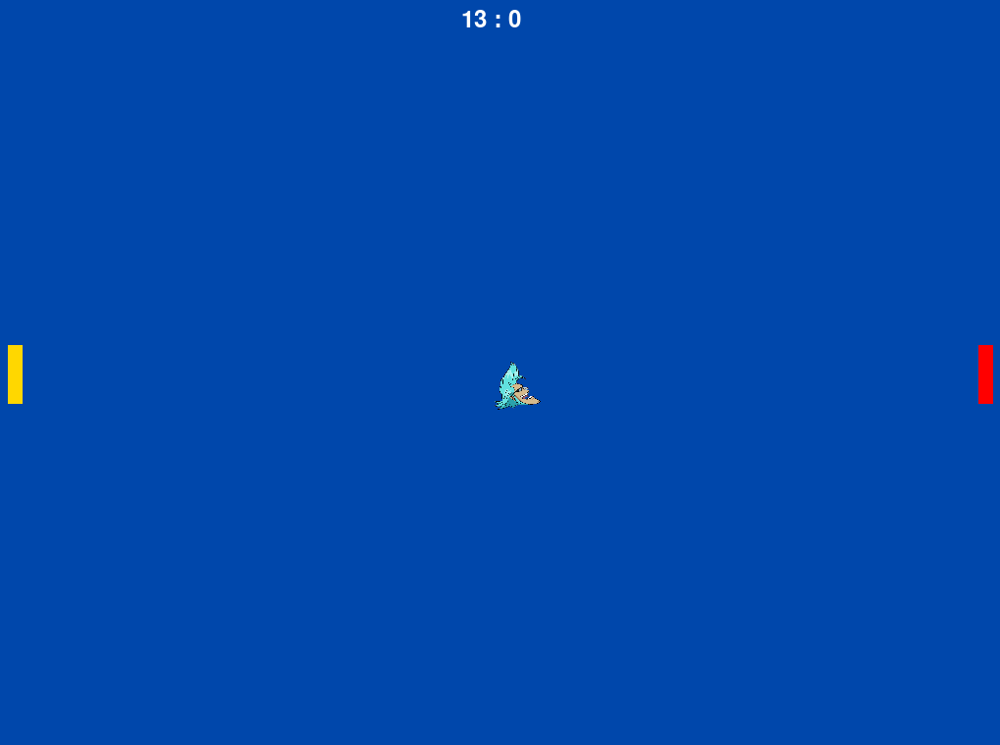

  

---

## ⚠️ Disclaimer

**SOUND ALERT.**

---

## 📦 Progetto

Il mio primo progetto Python:

Un gioco di ping pong con una palla che si muove in base alla pressione delle frecce direzionali o W e S.

Quando la palla tocca il bordo della finestra, riflette verticalmente, mentre se la palla tocca uno dei due paddle, riflette orizzontalmente.

Il punteggio viene aggiornato ogni volta che la palla tocca il bordo opposto della finestra.

Ho aggiunto una palla modificata utilizzando un PNG e aggiunto dei suoni per gli score, e una musica background.

Il gioco è a tema Franky di One Piece.

Enjoy! :D

---

## 📺 Preview

